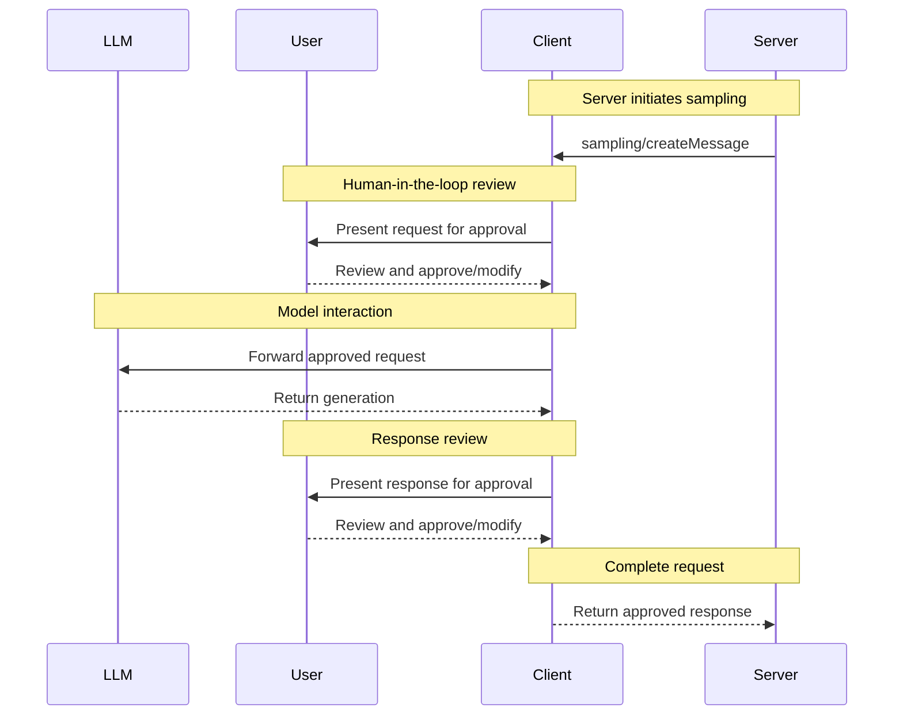
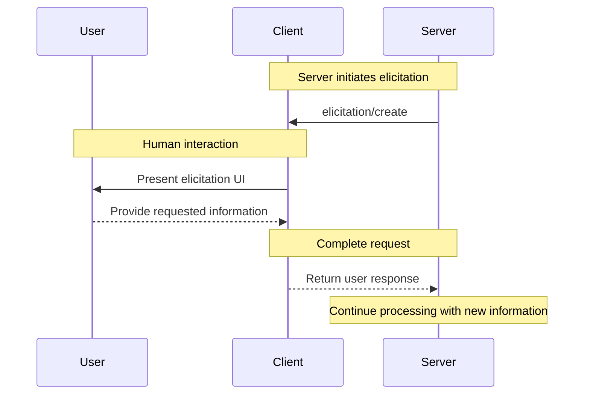

# MCP

> [MCP-python-sdk](https://github.com/modelcontextprotocol/python-sdk)
>
> [Quick Start Video on X](https://x.com/sdrzn/status/1867271665086074969) use cline on UI and config for mcp servers

1. 用户向LLM提问
2. LLM分析问题，分析已有MCP server和MCP tools，决定调用MCP tool。（不调用的就和MCP无关了）
3. MCP client调用MCP server tool
4. MCP server tool返回结果，这里的结果是先返回给MCP client还是MCP server？

```bash
uv run mcp install main.py # install for Claude Desktop
uv run mcp dev main.py # Run a MCP server with the MCP Inspector
uv run mcp --help # show cmd help
```

| Feature     | Explanation                                                  | Data Flow          | Request        | Response       |
| ----------- | ------------------------------------------------------------ | ------------------ | -------------- | -------------- |
| Tools       | Host让Server做些操作                                         | Server->H          | H->C->S        | S->C->H        |
| Resources   | Host向Server拿数据                                           | Server->H          | H->C->S        | S->C->H        |
| Prompts     |                                                              |                    |                |                |
| Roots       | 。唯一MCP读写Local Files的                                   | LocalFiles->Server |                |                |
| Sampling    | Server通过Client使用LLM。唯一MCP利用LLM的                    | LLM->Server        | S->C->[U]->LLM | LLM->C->[U]->S |
| Elicitation | Server向User请求补充信息/确认。唯一Server一定要从User拿信息的 | User->Server       | S->C->U        | U->C->S        |

> H: Host; C: Client; S: Server; U: User; 


## Environment Preparation

An example in vscode and cline:

1. mcp[cli]: `uv add "mcp[cli]"` or `uv pip install "mcp[cli]"`, test with `uv run mcp`
2. npx: [nodejs-install](https://nodejs.org/en/download/current), test with `npm -v`
3. [opt] mcp-servers-config in vscode (Workspace-ver): command+shift+P or F1 -> MCP: Open Workspace Folder MCP Configuration -> add mcp servers's config
4. mcp-servers-config in cline: cline -> mcp-servers -> Installed -> Configure MCP Servers -> copy same config from vscode

> If a wrong LLM used in adding a new mcp server with cline task chat window, mcp servers maybe installed failed. XD
>

## Usage Settings

```json
{
  "mcpServers": {
    "filesystem": {  // A friendly name for the server that appears in Claude Desktop // 需要对应 mcp server中的名字 FastMCP(xx)
      "command": "npx",  // Uses Node.js’s npx tool to run the server
      "args": [
        "-y",  // Automatically confirms the installation of the server package
        "@modelcontextprotocol/server-filesystem",  // The package name of the Filesystem Server
        "/Users/username/Desktop",  // Directories the server is allowed to access // 取决于具体的mcp server需要什么参数
        "/Users/username/Downloads"  // 这里代表 filesystem 允许访问的路径
      ]
    },
    "weather": {  // 需要和 mcp server 名字对应，即使用类似 FastMCP("weather") 的方式创建 mcp server
      "command": "uv",  // 使用uv
      "args": [
        "--directory",
        "/ABSOLUTE/PATH/TO/PARENT/FOLDER/weather",  // mcp server的绝对路径
        "run",
        "weather.py"  // mcp server入口, FastMCP(xxx)所在的地方
      ]
    }
  }
}
```

---

## Architecture

> MCP Host <- One-to-Many -> MCP Client <- One-to-One -> MCP Server

- **MCP Host**: The AI application that coordinates and manages one or multiple MCP clients. 宿主，管理多个MCP clients。例如Claude、Cline
- **MCP Client**: A component that maintains a connection to an MCP server and obtains context from an MCP server for the MCP host to use. MCP客户端用于维护与MCP server的连接，并负责MCP Server和Host之间的通信。
- **MCP Server**: A program that provides context to MCP clients. 一个给MCP client提供上下文的程序。这里的上下文指给Host的信息，与MCP server参数中的Context不是同一个东西。

MCP包括两个层：数据层 Data Layer 和传输层 Transport Layer。

- **Data Layer 数据层**：定义了基于JSON-RPC 2.0的客户端-服务器通信协议，including lifecycle management, and core primitives, such as tools, resources, prompts and notifications.。
- **Transport Layer 传输层**：定义客户端-服务器剪的信息交换机制和渠道。Defines the communication mechanisms and channels that enable data exchange between clients and servers, including transport-specific connection establishment, message framing, and authorization.

### Layer: Data Layer

> 决定了MCP server如何向MCP client上下文。进而很大程度上决定如何向AI传递上下文。

数据层实现了一个基于JSON-RPC 2.0的定义了消息格式、语义的数据交换协议。The data layer implements a [JSON-RPC 2.0](https://www.jsonrpc.org/) based exchange protocol that defines the message structure and semantics. This layer includes:

- **Lifecycle management**: Handles connection initialization, capability negotiation, and connection termination between clients and servers. 连接初始化、能力协商、连接终止。
- **Server features**: Enables servers to provide core functionality including tools for AI actions, resources for context data, and prompts for interaction templates from and to the client
- **Client features**: Enables servers to ask the client to sample from the host LLM, elicit input from the user, and log messages to the client
- **Utility features**: Supports additional capabilities like notifications for real-time updates and progress tracking for long-running operations

> JSON-RPC 2.0: 轻量、语言无关、传输层无关（可用HTTP TCP WebSocket）、支持通知（client可发送无需server响应的notification）、支持批量请求（Batch，允许一个消息发送多个请求/通知，server会逐个处理并响应）、标准化错误处理
>
> ```json
> {  // Request
>     "jsonrpc": "2.0",
>     "method": "method_name",
>     "params": [param1, param2] | {"param1": value1, "param2": value2},
>     "id": id_value  // 用于唯一标识一个请求，并确保客户端能够将服务器的响应与相应的请求正确匹配起来 // id可选，如果省略则为通知
> }
> {  // Success Response
>     "jsonrpc": "2.0",
>     "result": result_data,
>     "id": id_value
> }
> {  // Error Response
>     "jsonrpc": "2.0",
>     "error": {
>         "code": error_code,
>         "message": "error_message",
>         "data": additional_data // 可选
>     },
>     "id": id_value // 如果请求有id则保持一致，否则为null
> }
> ```
>
>

#### Lifecycle management

> <https://modelcontextprotocol.io/specification/2025-06-18/basic/lifecycle>

MCP是有状态协议，生命周期管理主要为了协商client/server支持的功能。

#### Primitives

MCP原语是MCP最重要的概念，确定了client和server可以互相提供什么，这些原语确定了与AI共享的上下文类型和AI可以操作的范围

MCP server定义了三种core原语：

- Tools: 让AI执行某些操作的可执行函数
- Resources: 给AI提供上下文的数据源
- Prompts: 有助于与LLM做结构化交互的可重用模版。(e.g., system prompts, few-shot examples)

每个primitive都有用于发现的`*/list`，用于获取的`*/get`方法，tool有执行`tools/call`方法。MCP client会使用`*/list`发现可用原语。

MCP client可以暴露如下原语，用于丰富MCP交互：

- **Sampling**: 允许server向client的AI应用（一般是LLM）发送请求。这是唯一一个MCP server可以通过client从LLM获取信息的特性。可以保持MCP模型的独立性，让MCP开发和LLM、AI SDK等独立开。Allows servers to request language model completions from the client’s AI application. This is useful when servers’ authors want access to a language model, but want to stay model independent and not include a language model SDK in their MCP server. They can use the `sampling/complete` method to request a language model completion from the client’s AI application.
- **Elicitation**: 允许server向用户请求额外信息，包括提示性信息、确认指令等。Allows servers to request additional information from users. This is useful when servers’ authors want to get more information from the user, or ask for confirmation of an action. They can use the `elicitation/request` method to request additional information from the user.
- **Logging**: 允许server向client发送调试、进度监控等调试信息。Enables servers to send log messages to clients for debugging and monitoring purposes.

#### Notifications

MCP协议支持实时notification，用于server client间的实时升级。例如server有tool增加或更改，可以向client发送notification。Notifications are sent as JSON-RPC 2.0 notification messages (without expecting a response) and enable MCP servers to provide real-time updates to connected clients.

#### Data Layer Procedure Example

> <https://modelcontextprotocol.io/docs/learn/architecture#data-layer-2>

1. Initialization (Lifecycle Management):
   1. Client <=> Server: `initialize` request. Client请求Server响应，交换或协商各自的ID、协议版本、支持的特性。Client/Server可能同时支持多个版本，但协商后只能使用其中一个版本。
   2. Client => Server: 成功初始化后，client发送notification给server表示client ready
2. Tool Discovery (Primitives)
   1. Client => Server: Client给Server发送 `tools/list` 请求，用于发现Server有哪些tools可用
   2. Server => Client: 返回可用tools数组

tools数组每个元素的字段包括：

- **`name`**: A unique identifier for the tool within the server’s namespace. This serves as the primary key for tool execution and should follow a clear naming pattern (e.g., `calculator_arithmetic` rather than just `calculate`)
- **`title`**: A human-readable display name for the tool that clients can show to users
- **`description`**: Detailed explanation of what the tool does and when to use it
- **`inputSchema`**: A JSON Schema that defines the expected input parameters, enabling type validation and providing clear documentation about required and optional parameters

> AI获取到 `tools/list` 请求的响应后，将不同MCP server的tools集合起来，AI就可以知道他能做什么，从而在后续的对话中用上

3. Tool Execution (Primitives)
   1. Client => Server: Client使用 `tools/call` method向Server发送tool调用请求。请求的params->name会和前面`tools/list`返回的某个tool的name严格对应
   2. Server => Client: 返回result

```json
{  // Request
  "jsonrpc": "2.0",
  "id": 3,
  "method": "tools/call",
  "params": {
    "name": "weather_current",
    "arguments": {
      "location": "San Francisco",
      "units": "imperial"
    }
  }
}
{  // Response
  "jsonrpc": "2.0",
  "id": 3,
  "result": {
    "content": [  // content是个 Array，支持text, images, resources, etc.
      {
        "type": "text",  // 表示这个content element的类型，这里表示是个纯文本text
        "text": "Current weather in San Francisco: 68°F, partly cloudy with light winds from the west at 8 mph. Humidity: 65%"
      }
    ]
  }
}
```

4. Real-time Updates (Notifications)

Key Features of MCP Notifications:

1. **No Response Required**: 无需响应。Notice there’s no `id` field in the notification. This follows JSON-RPC 2.0 notification semantics where no response is expected or sent.
2. **Capability-Based**: 基于能力。如果初始化阶段没有声明Server有notification能力就不可用。This notification is only sent by servers that declared `"listChanged": true` in their tools capability during initialization (as shown in Step 1).
3. **Event-Driven**: 内部状态改变驱动的。The server decides when to send notifications based on internal state changes, making MCP connections dynamic and responsive.

### Layer: Transport Layer

传输层管理通信通道和认证。The transport layer manages communication channels and authentication between clients and servers. It handles connection establishment, message framing, and secure communication between MCP participants.MCP supports two transport mechanisms:

- **Stdio transport**: 在同一台机器上使用进程通信的标准输入/输出。Uses standard input/output streams for direct process communication between local processes on the same machine, providing optimal performance with no network overhead.
- **Streamable HTTP transport**: Uses HTTP POST for client-to-server messages with optional Server-Sent Events for streaming capabilities. This transport enables remote server communication and supports standard HTTP authentication methods including bearer tokens, API keys, and custom headers. MCP recommends using OAuth to obtain authentication tokens.

---

## Debugging

> <https://modelcontextprotocol.io/legacy/tools/debugging>

- **MCP Inspector**: UI界面的server测试

- **Claude Desktop Developer Tools**: 集成测试、chrome DevTools集成测试. MCP logs from Claude Desktop: `tail -n 20 -F ~/Library/Logs/Claude/mcp*.log`

- **Server Logging**: 自定义logging实现、性能监控

### Inspector

> <https://modelcontextprotocol.io/legacy/tools/inspector>

用于调试MCP server的可交互式UI工具。

```bash
npx @modelcontextprotocol/inspector <command>
npx @modelcontextprotocol/inspector <command> <arg1> <arg2>
npx -y @modelcontextprotocol/inspector npx <package-name> <args>  # 调试发布到npm的包
npx -y @modelcontextprotocol/inspector npx @modelcontextprotocol/server-filesystem /Users/username/Desktop  # https://www.npmjs.com/package/@modelcontextprotocol/server-filesystem
npx @modelcontextprotocol/inspector uvx <package-name> <args>  # 调剂发布到PyPi的包
npx @modelcontextprotocol/inspector uvx mcp-server-git --repository ~/code/mcp/servers.git

npx @modelcontextprotocol/inspector node path/to/server/index.js args... # Local TypeScript mcp server
npx @modelcontextprotocol/inspector uv --directory path/to/server run package-name args...  # Local python mcp server
```

- Server connection pane: 左侧，展示/设定传输类型、启动命令、环境变量
- 功能测试：上方选择各种MCP server暴露的接口的测试子介面，Resource, Prompts, Tools等。中间是测试发起的按钮，对应server暴露的接口的调用测试。或者有其他方式发起的测试的log
- Notifications pane: Presents all logs recorded from the server. Shows notifications received from the server

---

## Base Protocol

### Lifecycle

### Transports

### Authentication

Authentication can be used by servers that want to expose tools accessing protected resources.

**Architecture:**

- **Authorization Server (AS)**: Handles OAuth flows, user authentication, and token issuance
- **Resource Server (RS)**: Your MCP server that validates tokens and serves protected resources
- **Client**: Discovers AS through RFC 9728, obtains tokens, and uses them with the MCP server

### Utilities

#### Cancellation

#### Ping

#### Progress

---

## Client

> MCP client是和MCP server交互的协议级组件。The host is the application users interact with, while clients are the protocol-level components that enable server connections.
>
> 这了把不同Feature分为Client和Server侧主要参考的MCP Specification，它分类的依据应该是以Feature实现该特性的主要SDK代码在哪一侧来确定的，而不是取决于Feature使用的地方在哪，如果按Feature在哪使用的话，这些Feature都应该分类为Server侧的。

| Feature         | Explanation                                                  | Example                                                      |
| --------------- | ------------------------------------------------------------ | ------------------------------------------------------------ |
| **Sampling**    | Sampling allows servers to request LLM completions through the client, enabling an agentic workflow. This approach puts the client in complete control of user permissions and security measures. | A server for booking travel may send a list of flights to an LLM and request that the LLM pick the best flight for the user. |
| **Roots**       | client给server指定哪些文件可以访问，引导server到对应目录，同时保证安全边界。 Roots allow clients to specify which files servers can access, guiding them to relevant directories while maintaining security boundaries. | A server for booking travel may be given access to a specific directory, from which it can read a user’s calendar. |
| **Elicitation** | 按需允许server向user请求信息/确认。Elicitation enables servers to request specific information from users during interactions, providing a structured way for servers to gather information on demand. | A server booking travel may ask for the user’s preferences on airplane seats, room type or their contact number to finalise a booking. |

#### Parsing Tool Results

> 和server的返回类型对照着看

When calling tools through MCP, the `CallToolResult` object contains the tool's response in a structured format. Understanding how to parse this result is essential for properly handling tool outputs.

```python
"""examples/snippets/clients/parsing_tool_results.py"""

import asyncio

from mcp import ClientSession, StdioServerParameters, types
from mcp.client.stdio import stdio_client


async def parse_tool_results():
    """Demonstrates how to parse different types of content in CallToolResult."""
    server_params = StdioServerParameters(
        command="python", args=["path/to/mcp_server.py"]
    )

    async with stdio_client(server_params) as (read, write):
        async with ClientSession(read, write) as session:
            await session.initialize()

            # Example 1: Parsing text content
            result = await session.call_tool("get_data", {"format": "text"})
            for content in result.content:
                if isinstance(content, types.TextContent):  # 非结构化输出
                    print(f"Text: {content.text}")

            # Example 2: Parsing structured content from JSON tools
            result = await session.call_tool("get_user", {"id": "123"})
            if hasattr(result, "structuredContent") and result.structuredContent:  # 结构化输出
                # Access structured data directly
                user_data = result.structuredContent
                print(f"User: {user_data.get('name')}, Age: {user_data.get('age')}")

            # Example 3: Parsing embedded resources
            result = await session.call_tool("read_config", {})
            for content in result.content:
                if isinstance(content, types.EmbeddedResource):  # 嵌套资源的server对应代码是什么？
                    resource = content.resource
                    if isinstance(resource, types.TextResourceContents):
                        print(f"Config from {resource.uri}: {resource.text}")
                    elif isinstance(resource, types.BlobResourceContents):
                        print(f"Binary data from {resource.uri}")

            # Example 4: Parsing image content
            result = await session.call_tool("generate_chart", {"data": [1, 2, 3]})
            for content in result.content:
                if isinstance(content, types.ImageContent):  # 前面提到的mcp的Image组件
                    print(f"Image ({content.mimeType}): {len(content.data)} bytes")

            # Example 5: Handling errors
            result = await session.call_tool("failing_tool", {})
            if result.isError:
                print("Tool execution failed!")
                for content in result.content:
                    if isinstance(content, types.TextContent):
                        print(f"Error: {content.text}")


async def main():
    await parse_tool_results()


if __name__ == "__main__":
    asyncio.run(main())
```

### Roots: Access to Local Files

> MCP协议中唯一与本地文件交互的功能

- 确定server可以访问哪些文件，允许client指定server可以哪些文件夹需要关注
- 不是授权server可以不受限制地访问给定的文件夹，而是引导server访问这些文件夹，并保证安全边界
- Roots始终使用`file://URL`的URI schema
- roots可以动态更新，client向server发送 `roots/list_changed` 的notification表示访问边界更新了

> Security Alert: roots特性只是告诉server可以在什么路径下操作，而文件访问的权限控制始终在client侧，本地文件的安全取决于client侧的安全策略。


### Sampling: Leveraging AI

> MCP协议中唯一 Server->Client->LLM 获取信息的功能
>
> 原义为采样，功能是MCP Server接收到某个参数的请求时，借由Client向LLM提问。这里sampling的含义代表的是啥？
>
> <https://modelcontextprotocol.io/specification/2025-06-18/client/sampling>

- MCP Server发起，经由有AI模型访问能力的MCP Client，向LLM提问，能够实现依赖AI的任务，而无需依赖具体的LLM或AI SDK。由于Sampling可以嵌入在其他操作中间，而且是一个分开的、独立的LLM call，所以Sampling既可以利用到其他操作获取的context，又可以利用context window增强LLM call的有效性。这里应该是想说Sampling是新开一个LLM对话过程，而context是Server决定的，可以决定用哪些已有的context，所以这种提问更有针对性，适合处理相对独立的需要LLM参与的子任务。！！！这里需要源码层和debug层确认一下。
- While not a requirement, sampling is designed to allow human-in-the-loop control. Users can maintain oversight through several mechanisms:
  - **Approval controls**: Sampling可能需要用户的显式同意。Client可以展示server想要分析什么以及原因。用户可以选择同意、拒绝、修改请求。Sampling requests may require explicit user consent. Clients can show what the server wants to analyze and why. Users can approve, deny, or modify requests.
  - **Transparency features**: Clients can display the exact prompt, model selection, and token limits, allowing users to review AI responses before they return to the server.
  - **Configuration options**: User可以设置LLM参数、自动同意的操作等。Client可以提供敏感信息编辑操作。Users can set model preferences, configure auto-approval for trusted operations, or require approval for everything. Clients may provide options to redact sensitive information.
  - **Security considerations**: Both clients and servers must handle sensitive data appropriately during sampling. Clients should implement rate limiting and validate all message content. The human-in-the-loop design ensures that server-initiated AI interactions cannot compromise security or access sensitive data without explicit user consent.



`tool`可以通过`sampling`(generating text)和LLM交互。Tools can interact with LLMs through sampling (generating text):

```python
from mcp.server.fastmcp import Context, FastMCP
from mcp.server.session import ServerSession
from mcp.types import SamplingMessage, TextContent

mcp = FastMCP(name="Sampling Example")


@mcp.tool()
async def generate_poem(topic: str, ctx: Context[ServerSession, None]) -> str:
    """Generate a poem using LLM sampling."""
    prompt = f"Write a short poem about {topic}" # LLM调mcp server后，mcp server将参数组合成prompt，再向LLM发送消息

    result = await ctx.session.create_message( # 这里会和LLM交互
        messages=[
            SamplingMessage(
                role="user",
                content=TextContent(type="text", text=prompt),
            )
        ],
        max_tokens=100,
    )

    if result.content.type == "text":
        return result.content.text
    return str(result.content)
```

```json
{  // Request parameters example:
  messages: [
    {
      role: "user",
      content: "Analyze these flight options and recommend the best choice:\n" +
               "[47 flights with prices, times, airlines, and layovers]\n" +
               "User preferences: morning departure, max 1 layover"  // 发给LLM的信息
    }
  ],
  modelPreferences: {  // 一些模型相关的参数
    hints: [{
      name: "claude-3-5-sonnet"  // Suggested model
    }],
    costPriority: 0.3,      // Less concerned about API cost
    speedPriority: 0.2,     // Can wait for thorough analysis
    intelligencePriority: 0.9  // Need complex trade-off evaluation
  },
  systemPrompt: "You are a travel expert helping users find the best flights based on their preferences",  // LLM prompt
  maxTokens: 1500
}
```


### Elicitation: Interaction with Users

> 唯一server->client->user请求信息的功能。引发/引出 <https://modelcontextprotocol.io/specification/2025-06-18/client/elicitation>
>
> elicit:[verb] evoke or draw out (a response, answer, or fact) from someone in reaction to one's own actions or questions.
>
> elicitation:[noun] the process of getting or producing something, especially information or a reaction

Request additional information from users. 向用户请求更多info/action. 

Elicitation通过让用户输入嵌套在其它mcp server feature中来实现可交互的工作流。mcp-protocol本身不限定Elicitation出现的位置，也不要求使用任何用户交互模型。这让server可以向user请求一些特定的输入，以避免整个流程直接终止或需要在流程早期就收集所有信息。





This example shows an Elicitation during a Tool Call:

```python
from pydantic import BaseModel, Field

from mcp.server.fastmcp import Context, FastMCP
from mcp.server.session import ServerSession

mcp = FastMCP(name="Elicitation Example")


class BookingPreferences(BaseModel):
    """Schema for collecting user preferences."""

    checkAlternative: bool = Field(description="Would you like to check another date?")
    alternativeDate: str = Field(
        default="2024-12-26",
        description="Alternative date (YYYY-MM-DD)",
    )


@mcp.tool()
async def book_table(date: str, time: str, party_size: int, ctx: Context[ServerSession, None]) -> str:
    """Book a table with date availability check."""
    # Check if date is available
    if date == "2024-12-25":
        # Date unavailable - ask user for alternative
        result = await ctx.elicit(
            message=(f"No tables available for {party_size} on {date}. Would you like to try another date?"),
            schema=BookingPreferences,
        )

        if result.action == "accept" and result.data:
            if result.data.checkAlternative:
                return f"[SUCCESS] Booked for {result.data.alternativeDate}"
            return "[CANCELLED] No booking made"
        return "[CANCELLED] Booking cancelled"

    # Date available
    return f"[SUCCESS] Booked for {date} at {time}"
```

The `elicit()` method returns an `ElicitationResult` with:

- `action`: "accept", "decline", or "cancel" 三种状态：接受、拒绝、取消
- `data`: The validated response (only when accepted)
- `validation_error`: Any validation error message

---

## Server

- `FastMCP`是MCP的核心介面
- connection management: 连接管理。
- protocol compliance: 协议遵守，协议规范。
- message routing: 消息路由。

The MCP protocol defines three core primitives that servers can implement:

| Primitive | Control                | Description                                       | Example Use                  |
| --------- | ---------------------- | ------------------------------------------------- | ---------------------------- |
| Prompts   | User-controlled        | Interactive templates invoked by user choice      | Slash commands, menu options |
| Resources | Application-controlled | Contextual data managed by the client application | File contents, API responses |
| Tools     | Model-controlled       | Functions exposed to the LLM to take actions      | API calls, data updates      |

- Prompts: 用户控制，用户选择的交互模板

**Server Capabilities**

MCP服务器功能

MCP servers declare capabilities during initialization:

| Capability    | Feature Flag              | Description                     |
| ------------- | ------------------------- | ------------------------------- |
| `prompts`     | `listChanged`             | Prompt template management      |
| `resources`   | `subscribe` `listChanged` | Resource exposure and updates   |
| `tools`       | `listChanged`             | Tool discovery and execution    |
| `logging`     | -                         | Server logging configuration    |
| `completions` | -                         | Argument completion suggestions |

### Development and Running

- Python >= 3.10
- stdio的map server不可以使用python`print`这种写入到stdio的输出。For STDIO-based server, never write to standard output (stdout). Writing to stdout will corrupt the JSON-RPC messages and break your server.

**Running MCP Server**

大致分为这几种：

- Claude Install: `uv run mcp install server.py` Claude做MCP host时使用
- MCP Inspector: `uv run mcp dev server.py [--with pandas --with numpy] [--with-editable .]` 开发调试时使用
- Direct Execution: `python server.py` or `uv run mcp run server.py` 不支持low-level server variant，只支持`FastMCP`，cline常用
- HTTP 远程调用常用

### Low-Level Server

> Caution: The `uv run mcp run` and `uv run mcp dev` tool doesn't support low-level server.

### Tools: AI Actions

- `Tools`是LLM通过MCP server操作的接口
- 通常会进行计算、产生副作用
- Tools can optionally receive a Context object by including a parameter with the `Context` type annotation. This context is automatically injected by the FastMCP framework and provides access to MCP capabilities.

```python
from mcp.server.fastmcp import Context, FastMCP
from mcp.server.session import ServerSession

mcp = FastMCP(name="Progress Example")


@mcp.tool()
async def long_running_task(task_name: str, ctx: Context[ServerSession, None], steps: int = 5) -> str:
    """Execute a task with progress updates."""
    await ctx.info(f"Starting: {task_name}")

    for i in range(steps):
        progress = (i + 1) / steps
        await ctx.report_progress(
            progress=progress,
            total=1.0,
            message=f"Step {i + 1}/{steps}",
        )
        await ctx.debug(f"Completed step {i + 1}")

    return f"Task '{task_name}' completed"
```

#### Date Types

##### Image: Handle Image

FastMCP provides an `Image` class that automatically handles image data:

```python
"""Example showing image handling with FastMCP."""

from PIL import Image as PILImage
from mcp.server.fastmcp import FastMCP, Image

mcp = FastMCP("Image Example")

@mcp.tool() # 这个案例在tool里面用 fastmcp.Image
def create_thumbnail(image_path: str) -> Image:
    """Create a thumbnail from an image"""
    img = PILImage.open(image_path)
    img.thumbnail((100, 100))
    return Image(data=img.tobytes(), format="png") # 这里用mcp的Image返回
```

##### Structured Output

```python
"""
Run from the repository root:
    uv run examples/snippets/servers/lowlevel/structured_output.py
"""

import asyncio
from typing import Any

import mcp.server.stdio
import mcp.types as types
from mcp.server.lowlevel import NotificationOptions, Server
from mcp.server.models import InitializationOptions

server = Server("example-server")


@server.list_tools()
async def list_tools() -> list[types.Tool]:
    """List available tools with structured output schemas."""
    return [ # List of Tool
        types.Tool(
            name="get_weather",  # tool的函数名
            description="Get current weather for a city",
            inputSchema={  # LLM调MCP Server tool的入参
                "type": "object",
                "properties": {"city": {"type": "string", "description": "City name"}},
                "required": ["city"],  # 必选参数
            },
            outputSchema={
                "type": "object",  # 指定 Structured data only
                "properties": {
                    "temperature": {"type": "number", "description": "Temperature in Celsius"},
                    "condition": {"type": "string", "description": "Weather condition"},
                    "humidity": {"type": "number", "description": "Humidity percentage"},
                    "city": {"type": "string", "description": "City name"},
                },
                "required": ["temperature", "condition", "humidity", "city"],  # 必选字段
            },
        )
    ]


@server.call_tool()
async def call_tool(name: str, arguments: dict[str, Any]) -> dict[str, Any]:
    """Handle tool calls with structured output."""
    if name == "get_weather":  # 这个name对应FastMCP @mcp.tool()的函数名
        city = arguments["city"]

        # Simulated weather data - in production, call a weather API
        weather_data = {
            "temperature": 22.5,
            "condition": "partly cloudy",
            "humidity": 65,
            "city": city,  # Include the requested city
        }

        # low-level server will validate structured output against the tool's
        # output schema, and additionally serialize it into a TextContent block
        # for backwards compatibility with pre-2025-06-18 clients.
        return weather_data
    else:
        raise ValueError(f"Unknown tool: {name}")


async def run():
    """Run the structured output server."""
    async with mcp.server.stdio.stdio_server() as (read_stream, write_stream):
        await server.run(
            read_stream,
            write_stream,
            InitializationOptions(
                server_name="structured-output-example",
                server_version="0.1.0",
                capabilities=server.get_capabilities(
                    notification_options=NotificationOptions(),
                    experimental_capabilities={},
                ),
            ),
        )


if __name__ == "__main__":
    asyncio.run(run())
```

Tools can return data in three ways:

1. **Content only**: Return a list of content blocks (default behavior before spec revision 2025-06-18)
2. **Structured data only**: Return a dictionary that will be serialized to JSON (Introduced in spec revision 2025-06-18)
3. **Both**: Return a tuple of (content, structured_data) preferred option to use for backwards compatibility

When an `outputSchema` is defined, the server automatically validates the structured output against the schema. This ensures type safety and helps catch errors early. 如果定义了`outputSchema`，server会用schema自动验证结构化输出，以确保类型安全。


有返回类型注解时`Tools`默认返回结构化数据，否则返回非结构化数据

Structured output supports these return types:

- Pydantic models (BaseModel subclasses)
- TypedDicts
- Dataclasses and other classes with type hints
- `dict[str, T]` (where T is any JSON-serializable type)
- Primitive types (str, int, float, bool, bytes, None) - wrapped in `{"result": value}`
- Generic types (list, tuple, Union, Optional, etc.) - wrapped in `{"result": value}`

Classes without type hints cannot be serialized for structured output. Only classes with properly annotated attributes will be converted to `Pydantic` models for schema generation and validation. 没有类型注释的类无法被序列化为结构化输出。只有正确注释属性的类才会被转换为Pydantic模型进行schema生成和验证。

Structured results are automatically validated against the output schema generated from the annotation. 结构化结果会用注解生成的输出模式做自动验证。 This ensures the tool returns well-typed, validated data that clients can easily process.

> In cases where a tool function's return type annotation causes the tool to be classified as structured *and this is undesirable*, the classification can be suppressed by passing `structured_output=False` to the `@tool` decorator. 如果`tool`函数的返回类型注解导致`tool`被分类为结构化的 是非预期的，可以传递`structured_output=False`给`@tool`装饰器来抑制分类

- <https://github.com/modelcontextprotocol/python-sdk/blob/main/examples/snippets/servers/structured_output.py>

### Resources: Context Data

> Server三大primitive中提供数据、上下文信息的
>
> they provide data but shouldn't perform significant computation or have side effects

- `Resources`向LLM暴露数据。类似REST API的GET
- 不应有大量计算或有副作用。

分为两种resources：

- **Direct Resources**: fixed URIs that point to specific data. `calendar://events/2024`
- **Resource Templates**: dynamic URIs with parameters for flexible queries.`travel://activities/{city}/{category}`URL里带参数的

**Protocol operations:**

| Method                     | Purpose                         | Returns                                |
| -------------------------- | ------------------------------- | -------------------------------------- |
| `resources/list`           | List available direct resources | Array of resource descriptors          |
| `resources/templates/list` | Discover resource templates     | Array of resource template definitions |
| `resources/read`           | Retrieve resource contents      | Resource data with metadata            |
| `resources/subscribe`      | Monitor resource changes        | Subscription confirmation              |

> 因此Inspector里面resource会有两个list，一个是list直接资源，一个list模版资源

### Prompts: Interaction Templates

> Server三大primitive中提供与LLM交互模版的

Prompts are reusable templates that help LLMs interact with your server effectively. `Prompts`是帮助LLM与MCP服务器高效交互的可重用模版。

prompts是用户控制的，需要显示调用，和resource一样支持参数补全。

| Method         | Purpose                                    | Returns                               |
| -------------- | ------------------------------------------ | ------------------------------------- |
| `prompts/list` | Discover available prompts 发现可用prompts | Array of prompt descriptors           |
| `prompts/get`  | Retrieve prompt details 获取prompt         | Full prompt definition with arguments |

```python
from mcp.server.fastmcp import FastMCP
from mcp.server.fastmcp.prompts import base

mcp = FastMCP(name="Prompt Example")

@mcp.prompt(title="Code Review")
def review_code(code: str) -> str:
    return f"Please review this code:\n\n{code}"

@mcp.prompt(title="Debug Assistant")
def debug_error(error: str) -> list[base.Message]:
    return [
        base.UserMessage("I'm seeing this error:"),
        base.UserMessage(error),
        base.AssistantMessage("I'll help debug that. What have you tried so far?"),
    ]
```

### Utilities

#### Completion: Suggestions

MCP supports providing completion suggestions for prompt arguments and resource template parameters. 为prompt参数/资源模版参数 提供补全建议。With the context parameter, servers can provide completions based on previously resolved values:

Server side: <https://github.com/modelcontextprotocol/python-sdk/blob/main/examples/snippets/servers/completion.py>

Client usage: <https://github.com/modelcontextprotocol/python-sdk/blob/main/examples/snippets/clients/completion_client.py>

```python
"""
cd to the `examples/snippets` directory and run:
    uv run completion-client
"""
import asyncio
import os

from mcp import ClientSession, StdioServerParameters
from mcp.client.stdio import stdio_client
from mcp.types import PromptReference, ResourceTemplateReference

# Create server parameters for stdio connection
server_params = StdioServerParameters(
    command="uv",  # Using uv to run the server
    args=["run", "server", "completion", "stdio"],  # Server with completion support
    env={"UV_INDEX": os.environ.get("UV_INDEX", "")},
)


async def run():
    """Run the completion client example."""
    async with stdio_client(server_params) as (read, write):
        async with ClientSession(read, write) as session: # 创建 mcp client session（一次对话？）
            # Initialize the connection
            await session.initialize()

            # List available resource templates
            templates = await session.list_resource_templates() # mcp server的资源模版
            print("Available resource templates:")
            for template in templates.resourceTemplates:
                print(f"  - {template.uriTemplate}")

            # List available prompts
            prompts = await session.list_prompts() # mcp server的prompts
            print("\nAvailable prompts:")
            for prompt in prompts.prompts:
                print(f"  - {prompt.name}")

            # Complete resource template arguments
            if templates.resourceTemplates:
                template = templates.resourceTemplates[0]
                print(f"\nCompleting arguments for resource template: {template.uriTemplate}")

                # Complete without context # 会调用到 mcp server 的 @mcp.completion()
                result = await session.complete(
                    ref=ResourceTemplateReference(type="ref/resource", uri=template.uriTemplate),
                    argument={"name": "owner", "value": "model"},
                )
                print(f"Completions for 'owner' starting with 'model': {result.completion.values}")

                # Complete with context - repo suggestions based on owner
                result = await session.complete(
                    ref=ResourceTemplateReference(type="ref/resource", uri=template.uriTemplate),
                    argument={"name": "repo", "value": ""},
                    context_arguments={"owner": "modelcontextprotocol"},
                )
                print(f"Completions for 'repo' with owner='modelcontextprotocol': {result.completion.values}")

            # Complete prompt arguments
            if prompts.prompts:
                prompt_name = prompts.prompts[0].name
                print(f"\nCompleting arguments for prompt: {prompt_name}")

                result = await session.complete(
                    ref=PromptReference(type="ref/prompt", name=prompt_name),
                    argument={"name": "style", "value": ""},
                )
                print(f"Completions for 'style' argument: {result.completion.values}")


def main():
    """Entry point for the completion client."""
    asyncio.run(run())


if __name__ == "__main__":
    main()
```

#### Logging

```python
# ❌ Bad (STDIO)
print("Processing request")

# ✅ Good (STDIO)
import logging
logging.info("Processing request")
```

使用`Context`做logging和notify。logging是与LLM无关的？notify应该也和LLM无关？

Tools can send logs and notifications through the context:

```python
from mcp.server.fastmcp import Context, FastMCP
from mcp.server.session import ServerSession

mcp = FastMCP(name="Notifications Example")


@mcp.tool()
async def process_data(data: str, ctx: Context[ServerSession, None]) -> str:
    """Process data with logging."""
    # Different log levels
    await ctx.debug(f"Debug: Processing '{data}'")
    await ctx.info("Info: Starting processing")
    await ctx.warning("Warning: This is experimental")
    await ctx.error("Error: (This is just a demo)")

    # Notify about resource changes
    await ctx.session.send_resource_list_changed()

    return f"Processed: {data}"
```

## Context

- `tool`, `resource`中用`Context`只需传递一个`Context`注解的参数（参数名字无要求）

```python
from mcp.server.fastmcp import Context, FastMCP
mcp = FastMCP(name="Context Example")

@mcp.tool()
async def my_tool(x: int, ctx: Context) -> str:
    """Tool that uses context capabilities."""
    # The context parameter can have any name as long as it's type-annotated
    return await process_with_context(x, ctx)
```

### Context Properties and Methods

- `ctx.request_id` - Unique ID for the current request
- `ctx.client_id` - Client ID if available
- `ctx.fastmcp` - Access to the FastMCP server instance (see [FastMCP Properties](https://github.com/modelcontextprotocol/python-sdk?tab=readme-ov-file#fastmcp-properties))
- `ctx.session` - Access to the underlying session for advanced communication (see [Session Properties and Methods](https://github.com/modelcontextprotocol/python-sdk?tab=readme-ov-file#session-properties-and-methods))
- `ctx.request_context` - Access to request-specific data and lifespan resources (see [Request Context Properties](https://github.com/modelcontextprotocol/python-sdk?tab=readme-ov-file#request-context-properties))
- `await ctx.debug(message)` - Send debug log message
- `await ctx.info(message)` - Send info log message
- `await ctx.warning(message)` - Send warning log message
- `await ctx.error(message)` - Send error log message
- `await ctx.log(level, message, logger_name=None)` - Send log with custom level
- `await ctx.report_progress(progress, total=None, message=None)` - Report operation progress
- `await ctx.read_resource(uri)` - Read a resource by URI
- `await ctx.elicit(message, schema)` - Request additional information from user with validation

### FastMCP Properties: ctx.fastmcp

可以通过`ctx.fastmcp`读写`FastMCP` server 实例的属性/元数据。The FastMCP server instance accessible via `ctx.fastmcp` provides access to server configuration and metadata:

- `ctx.fastmcp.name` - The server's name as defined during initialization
- `ctx.fastmcp.instructions` - Server instructions/description provided to clients
- `ctx.fastmcp.settings` - Complete server configuration object containing:
  - `debug` - Debug mode flag
  - `log_level` - Current logging level
  - `host` and `port` - Server network configuration
  - `mount_path`, `sse_path`, `streamable_http_path` - Transport paths
  - `stateless_http` - Whether the server operates in stateless mode
  - And other configuration options

### Session Properties and Methods: ctx.session

 `ctx.session` 提供client通信的高级控制。The session object accessible via `ctx.session` provides advanced control over client communication:

- `ctx.session.client_params` - Client initialization parameters and declared capabilities
- `await ctx.session.send_log_message(level, data, logger)` - Send log messages with full control
- `await ctx.session.create_message(messages, max_tokens)` - Request LLM sampling/completion 除了这个，貌似都属于logging功能或read方法
- `await ctx.session.send_progress_notification(token, progress, total, message)` - Direct progress updates
- `await ctx.session.send_resource_updated(uri)` - Notify clients that a specific resource changed
- `await ctx.session.send_resource_list_changed()` - Notify clients that the resource list changed
- `await ctx.session.send_tool_list_changed()` - Notify clients that the tool list changed
- `await ctx.session.send_prompt_list_changed()` - Notify clients that the prompt list changed

### Request Context Properties: ctx.request_context

The request context accessible via `ctx.request_context` contains request-specific information and resources:

- `ctx.request_context.lifespan_context` - Access to resources initialized during server startup
  - Database connections, configuration objects, shared services
  - Type-safe access to resources defined in your server's lifespan function
- `ctx.request_context.meta` - Request metadata from the client including:
  - `progressToken` - Token for progress notifications
  - Other client-provided metadata
- `ctx.request_context.request` - The original MCP request object for advanced processing
- `ctx.request_context.request_id` - Unique identifier for this request

### Develop Mode: Inspector

The fastest way to test and debug your server is with the MCP Inspector:

```bash
uv run mcp dev server.py

# Add dependencies
uv run mcp dev server.py --with pandas --with numpy

# Mount local code
uv run mcp dev server.py --with-editable .
```

## An All-in-One demo

### Stdio MCP Server
